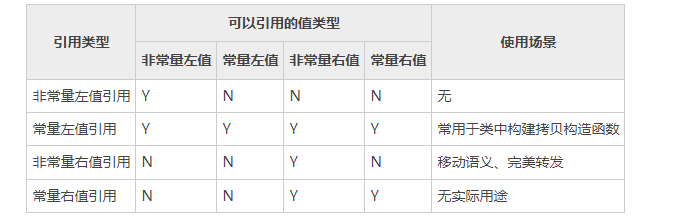
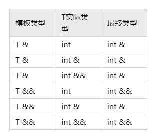

<!-- TOC -->

- [一、C++内存](#%E4%B8%80c%E5%86%85%E5%AD%98)
    - [C++内存管理结构](#c%E5%86%85%E5%AD%98%E7%AE%A1%E7%90%86%E7%BB%93%E6%9E%84)
    - [堆、栈对比](#%E5%A0%86%E6%A0%88%E5%AF%B9%E6%AF%94)
    - [内存泄漏](#%E5%86%85%E5%AD%98%E6%B3%84%E6%BC%8F)
    - [程序启动的过程](#%E7%A8%8B%E5%BA%8F%E5%90%AF%E5%8A%A8%E7%9A%84%E8%BF%87%E7%A8%8B)
    - [atomoic内存](#atomoic%E5%86%85%E5%AD%98)
    - [内存对齐](#%E5%86%85%E5%AD%98%E5%AF%B9%E9%BD%90)
    - [智能指针](#%E6%99%BA%E8%83%BD%E6%8C%87%E9%92%88)
        - [shared_ptr 成员函数](#shared_ptr-%E6%88%90%E5%91%98%E5%87%BD%E6%95%B0)
        - [weak_ptr 成员函数](#weak_ptr-%E6%88%90%E5%91%98%E5%87%BD%E6%95%B0)
- [二、面向对象](#%E4%BA%8C%E9%9D%A2%E5%90%91%E5%AF%B9%E8%B1%A1)
    - [定义](#%E5%AE%9A%E4%B9%89)
    - [重写（覆盖）、重载、隐藏（重定义）](#%E9%87%8D%E5%86%99%E8%A6%86%E7%9B%96%E9%87%8D%E8%BD%BD%E9%9A%90%E8%97%8F%E9%87%8D%E5%AE%9A%E4%B9%89)
    - [重载和重写的实现](#%E9%87%8D%E8%BD%BD%E5%92%8C%E9%87%8D%E5%86%99%E7%9A%84%E5%AE%9E%E7%8E%B0)
    - [虚函数、纯虚函数、虚函数表](#%E8%99%9A%E5%87%BD%E6%95%B0%E7%BA%AF%E8%99%9A%E5%87%BD%E6%95%B0%E8%99%9A%E5%87%BD%E6%95%B0%E8%A1%A8)
        - [虚函数的概念](#%E8%99%9A%E5%87%BD%E6%95%B0%E7%9A%84%E6%A6%82%E5%BF%B5)
        - [虚函数表](#%E8%99%9A%E5%87%BD%E6%95%B0%E8%A1%A8)
    - [继承中的构造函数、析构函数、拷贝构造函数](#%E7%BB%A7%E6%89%BF%E4%B8%AD%E7%9A%84%E6%9E%84%E9%80%A0%E5%87%BD%E6%95%B0%E6%9E%90%E6%9E%84%E5%87%BD%E6%95%B0%E6%8B%B7%E8%B4%9D%E6%9E%84%E9%80%A0%E5%87%BD%E6%95%B0)
    - [构造函数中的初始化列表](#%E6%9E%84%E9%80%A0%E5%87%BD%E6%95%B0%E4%B8%AD%E7%9A%84%E5%88%9D%E5%A7%8B%E5%8C%96%E5%88%97%E8%A1%A8)
    - [拷贝构造函数与赋值运算符、深拷贝与浅拷贝](#%E6%8B%B7%E8%B4%9D%E6%9E%84%E9%80%A0%E5%87%BD%E6%95%B0%E4%B8%8E%E8%B5%8B%E5%80%BC%E8%BF%90%E7%AE%97%E7%AC%A6%E6%B7%B1%E6%8B%B7%E8%B4%9D%E4%B8%8E%E6%B5%85%E6%8B%B7%E8%B4%9D)
    - [左值引用](#%E5%B7%A6%E5%80%BC%E5%BC%95%E7%94%A8)
    - [右值引用和完美转发](#%E5%8F%B3%E5%80%BC%E5%BC%95%E7%94%A8%E5%92%8C%E5%AE%8C%E7%BE%8E%E8%BD%AC%E5%8F%91)
        - [左值和右值](#%E5%B7%A6%E5%80%BC%E5%92%8C%E5%8F%B3%E5%80%BC)
        - [右值引用的意义](#%E5%8F%B3%E5%80%BC%E5%BC%95%E7%94%A8%E7%9A%84%E6%84%8F%E4%B9%89)
        - [std::move作用和实现](#stdmove%E4%BD%9C%E7%94%A8%E5%92%8C%E5%AE%9E%E7%8E%B0)
        - [万能引用与类型推导](#%E4%B8%87%E8%83%BD%E5%BC%95%E7%94%A8%E4%B8%8E%E7%B1%BB%E5%9E%8B%E6%8E%A8%E5%AF%BC)
        - [std::forward作用和实现](#stdforward%E4%BD%9C%E7%94%A8%E5%92%8C%E5%AE%9E%E7%8E%B0)
        - [lgj师兄给我看的面试题改编](#lgj%E5%B8%88%E5%85%84%E7%BB%99%E6%88%91%E7%9C%8B%E7%9A%84%E9%9D%A2%E8%AF%95%E9%A2%98%E6%94%B9%E7%BC%96)
    - [static_cast与dynamic_cast](#static_cast%E4%B8%8Edynamic_cast)
    - [template模板](#template%E6%A8%A1%E6%9D%BF)
        - [模板实例化](#%E6%A8%A1%E6%9D%BF%E5%AE%9E%E4%BE%8B%E5%8C%96)
        - [模板具象化](#%E6%A8%A1%E6%9D%BF%E5%85%B7%E8%B1%A1%E5%8C%96)
    - [多继承](#%E5%A4%9A%E7%BB%A7%E6%89%BF)
        - [多继承的用法](#%E5%A4%9A%E7%BB%A7%E6%89%BF%E7%9A%84%E7%94%A8%E6%B3%95)
        - [菱形继承与虚继承](#%E8%8F%B1%E5%BD%A2%E7%BB%A7%E6%89%BF%E4%B8%8E%E8%99%9A%E7%BB%A7%E6%89%BF)

<!-- /TOC -->
# 一、C++内存

## 1.1 C++内存管理结构

**Q: C++内存管理结构？内存分配方式？**

在C++中，内存分成5个区，他们分别是堆、栈、自由存储区、全局/静态存储区和常量存储区。


堆：由低向高生长，动态申请空间（malloc）的位置。需要程序员自己free。

栈：由高向低生长，调用函数的时候，函数内部的局部变量存储在堆上，函数结束后这些空间会自动释放。除此之外，调用函数外的下一条可执行语句、函数的各个参数也保存在栈上。

静态存储区(bss/data)：存储全局变量和静态变量。

自由存储区：new/delete

bss/data: bss存储未初始化、初始化为0的全局变量和静态变量。

```
堆是操作系统维护的一块内存，而自由存储是C++中通过new与delete动态分配和释放对象的抽象概念。堆与自由存储区并不等价。
```

常量存储区：存储常量的位置，不允许修改。

## 1.2 堆、栈对比

**Q: 堆、栈有什么区别？**

|          | 堆                               | 栈                                     |
| -------- | -------------------------------- | -------------------------------------- |
| 用处     | malloc空间时使用                 | 调用函数时使用                         |
| 大小     | 受限于计算机系统中有效的虚拟内存 | Linux下，默认栈空间大小为8MB，可以修改 |
| 结构     | 类似链表                         | 先进后出                               |
| 由谁分配 | 程序员                           | 编译器（系统）                         |
| 生长方向 | 从高到低                         | 从低到高                               |

## 1.3 内存泄漏

**Q: 什么是内存泄漏？**

申请一块空间，使用完毕后未释放。

**Q: 内存泄漏的危害？**

对自己这段程序有影响：自己的应用程序无法使用那片内存。

只发生一次的小的内存泄漏可能不会被注意，但泄漏大量内存的程序或泄漏日益增多的程序可能会表现出各种征兆：从性能不良（并且逐渐降低）到内存完全用尽。 

**Q: 哪些操作会导致内存泄漏？**

1. malloc没free

2. 子类继承父类时，父类析构函数不是虚函数。（静态类型为父类，动态类型为子类时）

   ```c++
   A* pa = new B();
   ```

   ```
   TODO:
   https://www.cnblogs.com/lizhenghn/p/3657717.html
   https://blog.csdn.net/ff_gogo/article/details/88720412
   这里虚函数、动态绑定的一些知识
   2023.2.16 stuyxr: 直白地讲，带有virtual的在运行时决定（编译的时候也无法确定呀），不带virtual的在编译时决定。
   为什么用虚函数：多态性。
   2023.2.17 stuyxr: 父类析构函数不是虚函数的时候，由于没有多态性，delete pa; 时，只会调用父类析构函数；如果父类析构函数是虚函数的时候，那么就先调用子类析构函数，再调用父类析构函数。如果在子类中有new或者malloc空间，前者就会出问题。
   ```

## 1.4 程序启动的过程

**Q: 程序启动的过程?**

**todo**

1. 操作系统首先创建相应的进程并分配私有的进程空间，然后操作系统的加载器负责把可执行文件的数据段和代码段映射到进程的虚拟内存空间中。
2. 加载器读入可执行程序的导入符号表，根据这些符号表可以查找出该可执行程序的所有依赖的动态链接库。
3. 加载器针对该程序的每一个动态链接库调用LoadLibrary （1）查找对应的动态库文件，加载器为该动态链接库确定一个合适的基地址。 （2）加载器读取该动态链接库的导入符号表和导出符号表，比较应用程序要求的导入符号是否匹配该库的导出符号。 （3）针对该库的导入符号表，查找对应的依赖的动态链接库，如有跳转，则跳到3 （4）调用该动态链接库的初始化函数
4. 初始化应用程序的全局变量，对于全局对象自动调用构造函数。
5. 进入应用程序入口点函数开始执行。

## atomoic内存

**todo**

## 1.5 内存对齐

**Q: 什么是对齐?**

4字节的int型，其起始地址应该位于4字节的边界上，即起始地址能够被4整除。

**Q: 为什么内存要对齐？**

计算机并非逐字节大小读写内存，而是以2,4,或8的倍数的字节块来读写内存。

规则：

- 结构体变量的首地址能够被其对齐字节数大小所整除。（不理解，感觉是废话）
- **结构体每个成员相对结构体首地址的偏移都是成员大小的整数倍**，如不满足，对前一个成员填充字节以满足。
- **结构体的总大小为结构体对最大成员大小的整数倍**，如不满足，最后填充字节以满足。

```
union example {
    int a[5];
    char b;
    double c;
}; // 24
struct example {
    int a[5];
    char b;
    double c;
} test_struct; // 32
struct example {
    char b;
    double c;
    int a;
} test_struct; // 24
```

## 1.6 智能指针

在c++中，智能指针一共定义了4种：
auto_ptr、unique_ptr、shared_ptr 和 weak_ptr。其中，auto_ptr 在 C++11已被摒弃，在C++17中已经移除不可用。

shared_ptr: 引用计数，引用计数达到0时，自动释放内存。例如下边`test`函数里`p`指向的空间在`test`结束后就会被自动释放掉。

### 1.6.1 shared_ptr 成员函数
| 函数名称 | 功能                    |
| ------------------------------------------------------------ | ----------------------------------------------------- |
| [(构造函数)](https://zh.cppreference.com/w/cpp/memory/shared_ptr/shared_ptr) | 构造新的 `shared_ptr` (公开成员函数)                         |
| [(析构函数)](https://zh.cppreference.com/w/cpp/memory/shared_ptr/~shared_ptr) | 如果没有更多 `shared_ptr` 指向持有的对象，则析构对象 (公开成员函数) |
| [operator=](https://zh.cppreference.com/w/cpp/memory/shared_ptr/operator%3D) | 对 `shared_ptr` 赋值 (公开成员函数)                          |
| [reset](https://zh.cppreference.com/w/cpp/memory/shared_ptr/reset) | 替换所管理的对象 (公开成员函数)                              |
| [swap](https://zh.cppreference.com/w/cpp/memory/shared_ptr/swap) | 交换所管理的对象 (公开成员函数)                              |
| [get](https://zh.cppreference.com/w/cpp/memory/shared_ptr/get) | 返回存储的指针 (公开成员函数)                                |
| [operator*, operator->](https://zh.cppreference.com/w/cpp/memory/shared_ptr/operator*) | 解引用存储的指针 (公开成员函数)                              |
| [operator[]](https://zh.cppreference.com/w/cpp/memory/shared_ptr/operator_at)(C++17) | 提供到被存储数组的带下标访问 (公开成员函数)                  |
| [use_count](https://zh.cppreference.com/w/cpp/memory/shared_ptr/use_count) | 返回 `shared_ptr` 所指对象的引用计数 (公开成员函数)          |
| [unique](https://zh.cppreference.com/w/cpp/memory/shared_ptr/unique)(C++20 前) | 检查所管理对象是否仅由当前 `shared_ptr` 的实例管理 (公开成员函数) |

### 1.6.2 weak_ptr 成员函数
| 函数名称 | 功能                    |
| ------------------------------------------------------------ | ----------------------------------------------------- |
| [(构造函数)](https://zh.cppreference.com/w/cpp/memory/weak_ptr/weak_ptr) | 构造新的`weak_ptr` (公开成员函数)                     |
| [(析构函数)](https://zh.cppreference.com/w/cpp/memory/weak_ptr/~weak_ptr) | 销毁 `weak_ptr` (公开成员函数)                        |
| [operator=](https://zh.cppreference.com/w/cpp/memory/weak_ptr/operator%3D) | 为`weak_ptr`赋值 (公开成员函数)                       |
| [reset](https://zh.cppreference.com/w/cpp/memory/weak_ptr/reset) | 释放被管理对象的所有权 (公开成员函数)                 |
| [swap](https://zh.cppreference.com/w/cpp/memory/weak_ptr/swap) | 交换被管理对象 (公开成员函数)                         |
| [use_count](https://zh.cppreference.com/w/cpp/memory/weak_ptr/use_count) | 返回管理该对象的 `shared_ptr` 对象数量 (公开成员函数) |
| [expired](https://zh.cppreference.com/w/cpp/memory/weak_ptr/expired) | 检查被引用的对象是否已删除 (公开成员函数)             |
| [lock](https://zh.cppreference.com/w/cpp/memory/weak_ptr/lock) | 创建管理被引用的对象的`shared_ptr` (公开成员函数)     |

weak_ptr: 和shared_ptr搭配使用。无法直接使用其地址。

```c++
void test() {
    shared_ptr<int> p(new int(10));
    shared_ptr<int> p2 = p;
    p0 = p;
    cout << p2.use_count() << endl; // 2
    cout << *p2 << endl; // 10
    cout << p0.lock() << endl; // 一个地址
}
int main() {
    test();
    cout << p0.lock() << endl; // 0(NULL)
    return 0;
}
```

```c++
# include <iostream>
# include <memory>
using namespace std;
struct Node
{
	std::shared_ptr<Node> Parent;
	std::weak_ptr<Node> LeftChild;
	std::weak_ptr<Node> RightChild;
	int Data;
	Node(int d) : Data(d) {}
	~Node()
	{
		std::cout << "~Node() called" << std::endl;
	}
};

void dfs(shared_ptr<Node> a) {
    cout << a->Data << endl;
    shared_ptr<Node> left = a->LeftChild.lock();
    if (left != nullptr)
        dfs(left);
    shared_ptr<Node> right = a->RightChild.lock();
    if (right != nullptr)
        dfs(right);
}
void Tree()
{
	std::shared_ptr<Node> a = std::make_shared<Node>(1);
	std::shared_ptr<Node> b = std::make_shared<Node>(2);
	std::shared_ptr<Node> c = std::make_shared<Node>(3);
	std::shared_ptr<Node> d = std::make_shared<Node>(4);
	std::shared_ptr<Node> e = std::make_shared<Node>(5);
	std::shared_ptr<Node> f = std::make_shared<Node>(6);
    a->LeftChild = b;
    a->RightChild = c;
    b->LeftChild = d;
    c->RightChild = e;
    c->LeftChild = f;
    dfs(a);
}
int main() {
    Tree();
    return 0;
}
/*
1
2
4
3
6
5
~Node() called
~Node() called
~Node() called
~Node() called
~Node() called
~Node() called
*/
```

**Q: new/delete和malloc/free的区别？**

总体来讲，new = malloc + constructor, new可以认为是malloc加上构造函数组成，delete可以认为是free加上析构函数组成。

注意：new对象数组需要类有默认构造函数

1. 概念的区别：malloc/free是C++/C语言的标准**库函数**，而new/delete是C++的**运算符**。
2. 使用上的区别：
   - new自动计算需要分配的空间，而malloc需要手动计算字节数。
   - new内置了安全检查功能，而malloc没有。
   - 可以重载new运算符，自定义分配内存策略。
   - 在使用malloc/free函数是需要库文件支持，而new/delete不需要。

**Q: new、operator new、placement new？**

1. new ：不能被重载，其行为总是一致的。它先调用operator new分配内存，然后调用构造函数初始化那段内存。

   new 操作符的执行过程：
   - 调用operator new分配内存 ；
   - 调用构造函数生成类对象；
   - 返回相应指针。

2. operator new：要实现不同的内存分配行为，应该重载operator new，而不是new。

   operator new就像operator + 一样，是可以重载的。如果类中没有重载operator new，那么调用的就是全局的::operator new来完成堆的分配。同理，operator new[]、operator delete、operator delete[]也是可以重载的。

3. placement new：只是operator new重载的一个版本。它并不分配内存，只是返回指向已经分配好的某段内存的一个指针。因此不能删除它，但需要调用对象的析构函数。

# 二、面向对象

## 2.1 定义

**Q: 什么是面向对象？面向对象和面向过程的区别？**

面向对象是一种编程思想，把一切东西看成是一个个对象，比如人、耳机、鼠标、水杯等，他们各自都有属性，比如：耳机是白色的，鼠标是黑色的，水杯是圆柱形的等等，把这些对象拥有的属性变量和操作这些属性变量的函数打包成一个类来表示。

面向过程：根据业务逻辑从上到下写代码

面向对象：将数据与函数绑定到一起，进行封装，这样能够更快速的开发程序，减少了重复代码的重写过程。

**Q: 对象的三大特征?**

封装、继承、多态。

1. 封装：将数据和操作数据的方法进行有机结合，隐藏对象的属性和实现细节，仅对外公开接口来和对象进行交互。

2. 继承：可以使用现有类的所有功能，并在无需重新编写原来的类的情况下对这些功能进行扩展。

   | 继承方式            | private继承     | protected继承     | public继承        |
   | ------------------- | --------------- | ----------------- | ----------------- |
   | 基类的private成员   | 不可见          | 不可见            | 不可见            |
   | 基类的protected成员 | 变为private成员 | 仍为protected成员 | 仍为protected成员 |
   | 基类的public成员    | 变为private成员 | 变为protected成员 | 仍为public成员    |

   友元函数、友元类

   类的友元函数是定义在类外部，但有权访问类的所有私有（private）成员和保护（protected）成员。尽管友元函数的原型有在类的定义中出现过，但是友元函数并不是成员函数。

   友元可以是一个函数，该函数被称为友元函数；友元也可以是一个类，该类被称为友元类，在这种情况下，整个类及其所有成员都是友元。

3. 多态：

   - 编译时多态性（静态多态）：通过重载函数实现：先期联编 early binding
   - 运行时多态性（动态多态）：通过重写虚函数实现 ：滞后联编 late binding

C++中默认为private继承。

**Q: class和struct的区别？**

1. C语言里的struct只是数据类型，不能定义函数。C++里的struct可以。
2. class默认private继承，struct默认public继承。
3. class默认数据访问控制时private，struct默认public。（变量类型）
4. class支持template，struct不支持。
5. 大括号初始化：如果没有定义构造函数，struct才可以用大括号初始化；如果没有定义构造函数，且所有成员变量全是public的话，class可以用大括号初始化；

## 2.2 重写（覆盖）、重载、隐藏（重定义）

静态多态：重载；动态多态：重写

1. 重载（overload）：同一可访问区内被声明的几个具有不同参数列（参数的类型，个数，顺序不同）的同名函数，根据参数列表确定调用哪个函数。

2. 重写（override）：基类中被virtual修饰的函数，在子类中被重新实现。

3. 隐藏（hide）：派生类的函数屏蔽了与其同名的基类函数。注意只要同名函数，不管参数列表是否相同，基类函数都会被隐藏。

   当参数不同时，无论基类中的函数是否被virtual修饰，基类函数都是被隐藏，而不是被重写。

```c++
#include <iostream>
using namespace std;
class A {
   public:
    virtual void func() { cout << "A::func();" << endl; }  // breakpoint1
    /*virtual*/ void func(int x) { cout << "A::func(int x);" << endl; } // breakpoint2
};

class B : public A {
   public:
    virtual void func() { cout << "B::func();" << endl; } // breakpoint3
};
```

breakpoint3重写breakpoint1，breakpoint2被隐藏。

## 2.3 重载和重写的实现

**Q：重载和重写的实现？**

重载：函数倾轧

重写：虚函数

## 2.4 虚函数、纯虚函数、虚函数表

### 2.4.1 虚函数的概念

**Q：虚函数的概念，作用？纯虚函数**

1. 虚函数：为了允许用基类的指针来调用子类的这个函数，用virtual关键字来修饰这个函数。用来重写。
2. 纯虚函数：`virtual void func() = 0;`。含有纯虚函数的类是抽象类。子类必须实现该函数。

### 2.4.2 虚函数表

**Q: 什么是虚函数表？**

如果对象存在虚函数，那么编译器就会生成一个指向虚函数表的指针，所有的虚函数都存在于这个表中，**虚函数表就可以理解为一个数组，每个单元用来存放虚函数的地址**。虚函数表（vftable）在编译阶段生成，构造函数之前。

`sizeof(Base1) = 8; sizeof(Derive) = 16; `     (考虑对齐)

```C++
class Base1 {
public:
	virtual void A() { cout << "Base1 A()" << endl; }
	virtual void B() { cout << "Base1 B()" << endl; }
	virtual void C() { cout << "Base1 C()" << endl; }
};

class Derive : public Base1{
public:
    int x;
	virtual void MyA() { cout << "Derive MyA()" << endl; }
};
```


重写就覆盖，比如`Derive`类中多一个`virtual void B() {}`，`Derive`对象的虚函数表中的第二个元素就会变成`Derive::B`。

**Q：多继承的虚函数表？**


**Q: 抽象类是否有虚函数表？**

有，相当于创建模板

**Q: 构造函数为什么不能是虚函数？**

虚函数调用的机制，是知道接口而不知道其准确对象类型的函数，但是创建一个对象，必须知道对象的准确类型；当一个构造函数被调用时，它做的首要事情之一就是初始化它的VPTR来指向VTABLE。

## 2.5 继承中的构造函数、析构函数、拷贝构造函数

1. 构造时，先构造父类，再构造子类部分，因此父类和子类的构造函数都会被调用

2. 析构时，分为几种情况

   - 父类指针指向子类，父类构造函数不是虚函数

     ```c++
     #include <cstdio>
     class parent {
        public:
         parent() {
             p = new int[10];
             printf("constructing parent\n");
         }
         ~parent() {
             delete[] p;
             printf("deleting parent\n");
         }
     
        private:
         int* p;
     };
     class child : public parent {
        public:
         child() { printf("constructing child\n"); }
         ~child() { printf("deleting child\n"); }
     };
     int main() {
         parent* p = new child();
         delete p;
     }
     /*
     constructing parent
     constructing child
     deleting parent
     */
     ```
   
   - 子类指针指向子类，父类构造函数不是虚函数
   
     ```c++
     #include <cstdio>
     class parent {
        public:
         parent() {
             p = new int[10];
             printf("constructing parent\n");
         }
         ~parent() {
             delete[] p;
             printf("deleting parent\n");
         }
     
        private:
         int* p;
     };
     class child : public parent {
        public:
         child() { printf("constructing child\n"); }
         ~child() { printf("deleting child\n"); }
     };
     int main() {
         child* p = new child();
         delete p;
     }
     /*
     constructing parent
     constructing child
     deleting child
     deleting parent
     */
     ```
   
   - 父类指针指向子类，父类构造函数是虚函数 
   
     ```c++
     #include <cstdio>
     class parent {
        public:
         parent() {
             p = new int[10];
             printf("constructing parent\n");
         }
         virtual ~parent() {
             delete[] p;
             printf("deleting parent\n");
         }
     
        private:
         int* p;
     };
     class child : public parent {
        public:
         child() { printf("constructing child\n"); }
         ~child() { printf("deleting child\n"); }
     };
     int main() {
         parent* p = new child();
         delete p;
     }
     /*
     constructing parent
     constructing child
     deleting child
     deleting parent
     */
     ```


3. 子类的拷贝构造函数，默认调用父类的构造函数。 **Q: 子类拷贝构造函数默认调用父类的哪个构造函数？**
    ```c++
    #include <cstdio>
    class parent {
       public:
        int* p;
        parent() { printf("constructing parent\n"); }
        parent(const parent& other) { printf("copying parent\n"); }
        ~parent() { printf("deleting parent\n"); }
    };
    class child : public parent {
       public:
        child() { printf("constructing child\n"); }
        child(const child& other) { printf("copying child\n"); }
        ~child() { printf("deleting child\n"); }
    };
    int main() {
        child a;
        child b = a;
        /*
        constructing parent
        constructing child
        constructing parent
        copying child
        */
    }
    ```

4. **Q: 构造函数为什么不能是虚函数？析构函数为什么需要是虚函数？**

    1. 从vptr角度解释

       虚函数的调用是通过虚函数表来查找的，而虚函数表由类的实例化对象的vptr指针(vptr可以参考C++的虚函数表指针vptr)指向，该指针存放在对象的内部空间中，需要调用构造函数完成初始化。如果构造函数是虚函数，那么调用构造函数就需要去找vptr，但此时vptr还没有初始化。

    2. 从多态角度解释

       虚函数主要是实现多态，在运行时才可以明确调用对象，根据传入的对象类型来调用函数，例如通过父类的指针或者引用来调用它的时候可以变成调用子类的那个成员函数。而构造函数是在创建对象时自己主动调用的，不可能通过父类的指针或者引用去调用。那使用虚函数也没有实际意义。

       在调用构造函数时还不能确定对象的真实类型（由于子类会调父类的构造函数）；并且构造函数的作用是提供初始化，在对象生命期仅仅运行一次，不是对象的动态行为，没有必要成为虚函数。

    3. 析构函数不是虚函数，会有上边第一条的问题。

## 2.6 构造函数中的初始化列表

构造函数的执行可以分成两个阶段，初始化阶段和计算阶段，初始化阶段先于计算阶段。

**Q: 哪些情况必须使用初始化列表？**

- 常量成员，因为常量只能初始化不能赋值，所以必须放在初始化列表里面
- 引用类型，引用必须在定义的时候初始化，并且不能重新赋值，所以也要写在初始化列表里面
- 没有默认构造函数的类类型，因为使用初始化列表可以不必调用默认构造函数来初始化，而是直接调用拷贝构造函数初始化。

**Q: 初始化列表在什么情况下会提高性能？**

对于类类型来说，最好使用初始化列表，因为少调用一次默认构造函数。(用一次构造函数代替了默认构造和赋值)

```c++
#include <cstdio>
#include <iostream>
using namespace std;
class Test1 {
   public:
    Test1()  // 无参构造函数
    {
        cout << "Construct Test1" << endl;
    }

    Test1(const Test1& t1)  // 拷贝构造函数
    {
        cout << "Copy constructor for Test1" << endl;
        this->a = t1.a;
    }

    Test1& operator=(const Test1& t1)  // 赋值运算符
    {
        cout << "assignment for Test1" << endl;
        this->a = t1.a;
        return *this;
    }

    int a;
};

class Test2 {
   public:
    Test1 test1;
    Test2(Test1& t1) { test1 = t1; }
};
int main() {
    Test1 t1;
    Test2 t2(t1);
    return 0;
}
/*
Construct Test1
Construct Test1
assignment for Test1
*/
```

```c++
#include <cstdio>
#include <iostream>
using namespace std;
class Test1 {
   public:
    Test1()  // 无参构造函数
    {
        cout << "Construct Test1" << endl;
    }

    Test1(const Test1& t1)  // 拷贝构造函数
    {
        cout << "Copy constructor for Test1" << endl;
        this->a = t1.a;
    }

    Test1& operator=(const Test1& t1)  // 赋值运算符
    {
        cout << "assignment for Test1" << endl;
        this->a = t1.a;
        return *this;
    }

    int a;
};

class Test2 {
   public:
    Test1 test1;
    Test2(Test1& t1) : test1(t1) {}
};
int main() {
    Test1 t1;
    Test2 t2(t1);
    return 0;
}
/*
Construct Test1
Copy constructor for Test1
*/
```

**Q: 类中初始化和初始化列表的顺序？**

- 如果有初始化列表，构造函数直接使用初始化列表的值，将不会选择类中初始化的值

- 如果没有初始化列表，构造函数将选择类中初始化的值

- 父类构造函数（有多个按照出现顺序构造）>成员类对象构造函数–>自身构造函数

  其中成员变量的初始化与声明顺序有关，构造函数的调用顺序是类派生列表中的顺序。

  析构顺序和构造顺序相反。

## 2.7 拷贝构造函数与赋值运算符、深拷贝与浅拷贝

**Q: 默认拷贝构造函数和默认赋值运算符？**

在默认情况下（用户没有定义，但是也没有显式的删除），编译器会自动的隐式生成一个拷贝构造函数和赋值运算符。但用户可以使用`delete`来指定不生成拷贝构造函数和赋值运算符，这样的对象就不能通过值传递，也不能进行赋值运算。这种拷贝时浅拷贝。

```c++
class Person
{
public:
	Person(const Person& p) = delete;
	Person& operator=(const Person& p) = delete;

private:
	int age;
	string name;
};
```

**Q: 什么时候用拷贝构造函数，什么时候用赋值？**

```c++
class Person {
   public:
    Person() { cout << "Default constructor" << endl; }
    Person(int age) {
        this->age = age;
        cout << "age constructor" << endl;
    }
    Person(const Person& p) {
        this->age = p.age;
        cout << "Copy Constructor" << endl;
    }

    Person& operator=(const Person& p) {
        cout << "Copy Assign" << endl;
        this->age = p.age;
        return *this;
    }
    Person(Person&& p) {
        swap(p.age, age);
        cout << "Move Constructor" << endl;
    }

    Person& operator=(Person&& p) {
        cout << "Move Assign" << endl;
        swap(p.age, age);
        return *this;
    }
    ~Person() { cout << "Destructor" << endl; }

    int age;
};
```

注意，`Person p1 = p;`看起来是赋值，其实是拷贝。（可以理解为编译器没那么傻。）

```c++
// -fno-elide-constructors 关掉编译器优化
void f(Person p) {
    return;
}
Person f1() {
    Person p;
    return p;
}
int main() {
    Person p;
    cout << endl;
    // Default constructor
    Person p1 = p;
    // Copy Constructor
    cout << endl;
    Person p2(p);
    // Copy Constructor
    cout << endl;
    p2 = p;
    // Copy Assign
    p2 = std::move(p);
    // Move Assign
    cout << endl;
    f(p2);
    // Copy Constructor
    // Destructor
    cout << endl;
    p2 = f1();
    // NRVO named return value optimization, 省略掉一次move ctor, dtor(临时变量的) 面试的时候不要考虑这个。不过可以提到一下？
    // Default constructor
    // Move constructor
    // Destructor
    // Move Assign
    // Destructor
    Person p3 = f1();
    // 不考虑编译器优化
    // Default constructor
    // Move constructor
    // Destructor
    // Move constructor
    // Destructor
    f(p3);
    // Copy Constructor
    // Destructor
    cout << endl;
    f(std::move(p3));
    // Move Constructor
    // Destructor
    return 0;
}
```

**Q: 深拷贝 浅拷贝？**

浅拷贝：只是简单的进行值的复制。通常，默认生成的拷贝构造函数和赋值运算符，是浅拷贝。

深拷贝：对于指针只是简单的值复制并不能分割开两个对象的关联，任何一个对象对该指针的操作都会影响到另一个对象。因此，对于指针和动态分配的空间，在拷贝中应重新分配分配空间。

## 2.8 左值引用

**Q: 指针和引用的区别？**

1. 指针可以指向NULL，引用不可以
2. 指针可以改变指向，引用不可以
3. 有多级指针，没有多级引用（但是有右值引用）
4. sizeof

## 2.9 右值引用和完美转发

### 左值和右值

lvalue 是“loactor value”的缩写，可意为存储在内存中、有明确存储地址（可寻址）的数据，而 rvalue 译为 "read value"，指的是那些可以提供数据值的数据（不一定可以寻址，例如存储于寄存器中的数据）。

- **泛左值 (glvalue)**（“泛化 (generalized)”的左值）是一个表达式，其值可确定某个对象或函数的标识；

- **纯右值 (prvalue)**

  （“纯 (pure)”的右值）是求值符合下列之一的表达式：

  - 计算某个运算符的操作数的值（这种纯右值没有*结果对象*）
  - 初始化某个对象（称这种纯右值有一个*结果对象*）。

- **亡值 (xvalue)**（“将亡 (expiring)”的值）是代表它的资源能够被重新使用的对象或位域的泛左值；
- **左值 (lvalue)**（如此称呼的历史原因是，左值可以在赋值表达式的左边出现）是非亡值的泛左值；
- **右值 (rvalue)**（如此称呼的历史原因是，右值可以在赋值表达式的右边出现）是纯右值或者亡值。

### 右值引用的意义



https://zhuanlan.zhihu.com/p/335994370

```c++
int &&ref_a = 5;
ref_a = 6; 
 
等同于以下代码：
 
int temp = 5;
int &&ref_a = std::move(temp);
ref_a = 6;
```

右值引用可以延长临时变量的生命周期。

const左值引用可以指向右值。

```c++
#include <iostream>

using namespace std;

int g_construct_count = 0;
int g_copyconstruct_count = 0;
int g_destruct_count = 0;

struct A
{
    A()
    {
        cout << "construct:" << ++g_construct_count << endl;
    }
    
    A(const A &a)
    {
        cout << "copyconstruct:" << ++g_copyconstruct_count << endl;
    }
    
    ~A()
    {
        cout << "destruct:" << ++g_destruct_count << endl;
    }
};

A GetA()
{
    int x;
    cout << &x << endl;
    return A();
}

int main()
{
    int x;
    cout << &x << endl;
    A&& a = GetA();
    cout << &a << endl;
    return 0;
}
/*
// 没有返回值优化
construct:1
copyconstruct:1
destruct:1
destruct:2

改成A a = GetA();
construct:1
copyconstruct:1
destruct:1
copyconstruct:2
destruct:2
destruct:3
*/
```

万能引用、引用折叠

### std::move()作用和实现

- c++11中提供了std::move()来将左值引用转换为右值引用，从而使用移动语义避免复制构造。move是将对象的状态或者所有权从一个对象转移到另一个对象，只是转移，没有内存拷贝。
- c++中所有容器都实现了move语义，方便我们实现性能优化。move对于拥有形如对内存、文件句柄等资源的成员的对象有效。如果是一些基本类型，比如int或char[10]数组等，如果使用move，仍然会发生拷贝（因为没有对应的移动构造函数)
- 别看它的名字叫move，其实std::move并不能移动任何东西，它唯一的功能是将一个左值/右值强制转化为右值引用，继而可以通过右值引用使用该值，所以称为移动语义。
- std::move的作用：将对象的状态或者所有权从一个对象转移到另一个对象，只是转移，没有内存的搬迁或者内存拷贝所以可以提高利用效率,改善性能。 它是怎么个转移法，将在文章的最后面解释。
- 看到std::move的代码，意味着给std::move的参数，在调用之后，就不再使用了。

```c++
template <typename T>
typename remove_reference<T>::type&& move(T&& t)
{
    return static_case<typename remove_reference<T>::type&&>(t);
}
```

### 万能引用与类型推导

```C++
#include <iostream>
using namespace std;

template<typename T>
void testForward(T && v){
    cout << v << endl;
}

int main(int argc, char * argv[])
{
    testForward(1); // 传入右值
    int x = 1;
    testForward(x); // 传入左值
    return 0;
}
```

**类型推导**



### std::forward()作用和实现

和移动语义的情况一样，显式使用static_cast类型转换进行转发不是一个便捷的方法。在C++11的标准库中提供了一个std::forward函数模板，在函数内部也是使用static_cast进行类型转换，只不过使用std::forward转发语义会表达得更加清晰，std::forward函数模板的使用方法也很简单。

```C++
template <typename T>
T&& forward(typename std::remove_reference<T>::type& param)
{
    return static_cast<T&&>(param);
}

template <typename T>
T&& forward(typename std::remove_reference<T>::type&& param)
{
    return static_cast<T&&>(param);
}
```

### lgj师兄给我看的面试题改编

**Q:**

```c++
#include <iostream>
#include <vector>
using namespace std;
class Data {
   public:
    int x;
    Data() {
        cout << "default constructor" << endl;
        x = 0;
    }
    Data(int x) {
        cout << "parameter constructor" << endl;
        this->x = x;
    }
    Data(Data& d) {
        cout << "copy constructor" << endl;
        this->x = d.x;
    }
    Data(Data&& d) {
        cout << "move constructor" << endl;
        this->x = d.x;
        d.x = -1;
    }
    Data& operator=(Data& d) {
        x = d.x;
        cout << "copy assignment operator" << endl;
        return *this;
    }
    Data& operator=(Data&& d) {
        x = d.x;
        d.x = -2;
        cout << "move assignment operator" << endl;
        return *this;
    }
    ~Data() { cout << "destructor" << endl; }
};
Data&& getData(Data&& data) {
    cout << &data << endl;
    return std::move(data);
}

int main() {
    Data temp = Data();
    cout << &temp << endl;
    auto data = getData(move(temp));
    int x;
    cout << &temp << " " << &data << endl;
    cout << "data.x:  " << data.x << endl;
    cout << "temp.x:  " << temp.x << endl;
    return 0;
}

```

输出为

```
default constructor
move constructor
destructor
0x61ff08
0x61ff08
move constructor
0x61ff08 0x61ff04
data.x:  0
temp.x:  -1
destructor
destructor
```

1. temp右边的`Data()`使用默认构造函数进行构造。
2. `Data()`是右值，`temp`使用移动构造函数构造。
3. `getData`中`data`为左值，将其转化为右值返回。
4. `data`使用移动构造函数进行构造，因为`getData(move(temp))`是右值。
5. `temp.x`在调用`getData`之前是0，后来用它构造函数`data`了，所以`temp.x`变成了-1。

进一步考虑，如果`auto data = getData(move(temp));`改为`auto&& data = getData(move(temp)); `  ，输出是什么

```
default constructor
move constructor
destructor
0x61ff04
0x61ff04
0x61ff04 0x61ff04
data.x:  0
temp.x:  0
destructor
```

在调用`getData`过程中，没有新对象构造，`data`也只是个右值引用，没有新对象构造。`data`和`temp`都指向同一个内存。

## 2.10 static_cast与dynamic_cast

1. static_cast在编译时期强制转换,dynamic_cast在运行时期转换。dynamic_cast更安全
2. 在类层次间进行上行转换时，dynamic_cast和static_cast的效果是一样的；
   在进行下行转换时，dynamic_cast具有类型检查的功能，比static_cast更安全。

## 2.11 template模板

### 模板实例化

```C++
template <typename T>
void Swap(T &a, T &b)
```

1. 显式实例化（explicit instantiation）

   ```C++
   template void Swap<int>(int &, int &);
   ```

   or

   ```C++
   Swap<int>(a, b);
   ```

2. 隐式实例化（implicit instantiation）

   隐式实例化比较简单，就是最正常的调用，`Swap(a, b)`，直接导致程序生成一个`Swap()`的实例，该实例使用的类型即参数a和b的类型，编译器根据参数来定义函数实例。

### 模板具象化

```c++
template <> void Swap(job &a, job &b)
{
    int temp;
    temp = a.salary;
    a.salary = b.salary;
    b.salary = temp;
}
```

## 2.12 多继承

### 多继承的用法

```c++
Derive d;
d.Base1::print();
// Derive继承自Base1 Base2 Base3
```
### 菱形继承与虚继承


虚继承解决了菱形继承的数据冗余和二义性的问题。

- 虚继承的作用：为了保证公共继承对象在创建时只保存一分实例
- 虚继承解决了菱形继承的两个问题：
  - 数据冗余：顶级基类在整个体系中只保存了一份实例
  - 访问不明确（二义性）：可以不通过作用域访问符::来调用（原理就是因为顶级基类在整个体系中只保存了一份实例）

虚继承的缺点

- 虚继承类的对象会更大一些；
- 虚继承类的成员访问会更慢一些；
- 虚继承类的初始化更反直觉一些。继承层级的最底层（most derived class）负责虚基类的初始化，而且负责整个继承链上所有虚基类的初始化。

```c++
class A
class B: public virtual A;
class C: public virtual A;
class D: public B, public C;
```
